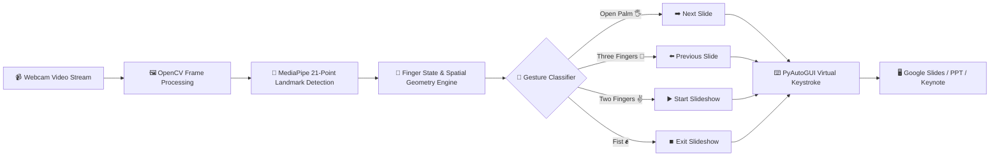

<div align="center">

  <!-- Header Banner with 🖐️ Hand & Glowing Gradient -->
  

  <!-- Animated Waving Hand & Dynamic Subtitle -->
  <h2>
    
    <span>Control Your Slides Hands-Free with AI & Computer Vision!</span>
    
  </h2>

  <!-- Animated Typing SVG -->
  <a href="https://git.io/typing-svg">
    
  </a>

  <br/><br/>

  <!-- High-Tech Shields Badges -->
  <p align="center">
    
    
    
    
    
  </p>

  <!-- Quick Nav Links -->
  <p align="center">
    <a href="#-overview">Overview</a> •
    <a href="#-super-quickstart-run-in-3-steps">Quickstart</a> •
    <a href="#-gesture-controls-matrix">Gestures</a> •
    <a href="#-key-features">Features</a> •
    <a href="#-how-it-works--architecture">Architecture</a> •
    <a href="#-installation--setup-guide">Installation</a> •
    <a href="#-how-to-use-step-by-step">Usage</a> •
    <a href="#-learning-outcomes">Learning Outcomes</a> •
    <a href="#-future-roadmap">Roadmap</a>
  </p>

  

</div>

---

# ⚡ Overview

**HandPilot** is a futuristic, touchless presentation control system that lets you control your Google Slides, Microsoft PowerPoint, Keynote, Canva, or PDF presentations using hand gestures through your laptop camera using **Computer Vision and AI**.

This project uses:
* **OpenCV** — Real-time computer vision frame capturing and visual feedback.
* **MediaPipe** — High-fidelity 21 3D hand landmark coordinate tracking.
* **PyAutoGUI** — Programmatic operating system keystroke automation.

To detect hand gestures in real-time and convert them into presentation controls like:
* ➡️ **Next Slide**
* ⬅️ **Previous Slide**
* ▶️ **Start Presentation**
* ⏹️ **Exit Presentation**

> 💡 **Why HandPilot?** Say goodbye to clickers, remotes, dongles, or staying glued to your keyboard during meetings, hackathons, or lectures. Just gesture naturally in front of your webcam!

---

# ⚡ Super Quickstart (Run in 3 Steps!)

If you want to test immediately, run these 3 commands:

```bash
# 1️⃣ Clone repo & enter folder
git clone https://github.com/supriyakarmakarr/HandPilot-.git
cd HandPilot-

# 2️⃣ Install libraries & download AI model
pip install -r requirements.txt
python setup_models.py

# 3️⃣ Launch HandPilot!
python main.py
```

---

# 🚀 Key Features

<table>
  <tr>
    <td width="50%">
      <h3>🔮 Real-Time Hand Tracking</h3>
      <p>Tracks 21 3D hand spatial landmarks with ultra-low latency (~30+ FPS) using Google's optimized ML pipelines.</p>
    </td>
    <td width="50%">
      <h3>🎯 Zero Extra Hardware Required</h3>
      <p>Works directly from standard 720p/1080p built-in laptop webcams or USB cameras. No sensors needed.</p>
    </td>
  </tr>
  <tr>
    <td width="50%">
      <h3>🛡️ Smart Gesture Debouncing</h3>
      <p>Built-in cooldown timing and state-locking mechanisms prevent accidental double-skips and flickering triggers.</p>
    </td>
    <td width="50%">
      <h3>🌐 Universal Deck Compatibility</h3>
      <p>Works seamlessly with <b>Google Slides, Microsoft PowerPoint, Apple Keynote, Canva, Notion, and PDF Readers</b>.</p>
    </td>
  </tr>
  <tr>
    <td width="50%">
      <h3>🎓 Beginner-Friendly Codebase</h3>
      <p>Clean, modular, and well-commented Python code designed for students, educators, and AI enthusiasts.</p>
    </td>
    <td width="50%">
      <h3>💻 Cross-Platform Support</h3>
      <p>Fully compatible with <b>Windows</b>, <b>macOS</b>, and <b>Linux</b> operating systems.</p>
    </td>
  </tr>
</table>

---

# 🎮 Gesture Controls Matrix

<div align="center">

| Gesture | Visual | Action | Triggered Shortcut | Description |
| :---: | :---: | :---: | :---: | :--- |
| **Open Palm** | 🖐️ | **Next Slide** | `Right Arrow (→)` / `Space` | All 5 fingers fully extended facing camera |
| **Three Fingers** | 🤟 / 🖖 | **Previous Slide** | `Left Arrow (←)` / `Backspace` | Index, Middle, & Ring fingers raised |
| **Victory / Peace** | ✌️ | **Start Slideshow** | `F5` / `Ctrl+F5` / `Cmd+Enter` | Index & Middle fingers extended (V sign) |
| **Closed Fist** | ✊ | **Exit Slideshow** | `Escape (Esc)` | All fingers curled into a tight fist |

</div>

<br/>

<div align="center">
  
  <p><em>MediaPipe 21 3D Hand Landmark Coordinates utilized by HandPilot</em></p>
</div>

---

# 🛠️ Technologies Used

* **[Python 3.9+](https://www.python.org/)** — Core programming language
* **[OpenCV (cv2)](https://opencv.org/)** — Webcam video capture & image pre-processing
* **[Google MediaPipe](https://ai.google.dev/edge/mediapipe/solutions/vision/hand_landmarker)** — 21 3D Hand Landmark Machine Learning model
* **[PyAutoGUI](https://pyautogui.readthedocs.io/)** — Cross-platform GUI keystroke automation

---

# 🧩 How It Works & Architecture



### The pipeline executes in 5 real-time stages:
1. **Captures webcam feed** using OpenCV at native frame rates.
2. **Detects 3D hand landmarks** using Google MediaPipe Hand Landmarker.
3. **Identifies finger positions & angles** by comparing fingertip landmarks with PIP joint heights.
4. **Maps detected gestures** to designated presentation control actions.
5. **Uses PyAutoGUI** to send native keyboard events to the focused presentation deck.

---

# 📦 Installation & Setup Guide

### Step 0 — Ensure Python is Installed

> **Note for Linux & Mac Users:** Please use `python3` instead of `python` and `pip3` instead of `pip`.

Check if Python is installed and available in your system PATH (VS Code Terminal → *Terminal → New Terminal*):
```bash
python --version
# or
python3 -V
```

---

### Step 1 — Download / Clone the Code

```bash
git clone https://github.com/supriyakarmakarr/HandPilot-.git
cd HandPilot-
```

---

### Step 2 — Install Dependencies

```bash
# Windows
python -m pip install -r requirements.txt

# Linux / macOS (or if using managed environments)
python3 -m pip install --break-system-packages -r requirements.txt
```

---

### Step 3 — Download Hand Landmarker Model

Run the helper script to download Google's official pre-trained MediaPipe task weights:
```bash
python setup_models.py
```
*(This automatically downloads `models/hand_landmarker.task`).*

---

# ▶️ Run the App

```bash
python main.py
```

---

# 🛑 How to Close / Exit the Application

* **Option 1:** Click on the OpenCV camera window and press **`q`** on your keyboard.
* **Option 2:** Press **`Ctrl + C`** in your terminal.

---

# 💻 macOS Permission Setup

For keyboard automation to work on macOS:

1. Go to: **System Settings** → **Privacy & Security**.
2. Scroll to **Accessibility** → Enable permissions for your terminal:
   * **Terminal** *OR*
   * **VS Code** *OR*
   * **PyCharm** *OR*
   * **iTerm2**
3. Scroll to **Input Monitoring** → Enable permissions for the same app.

> ⚠️ *Without these permissions, macOS security policies will block PyAutoGUI from controlling Google Slides.*

---

# 🎯 How to Use (Step-by-Step)

```
[ Step 1 ] Open Google Slides in Google Chrome (or PowerPoint / PDF / Canva)
     ↓
[ Step 2 ] Launch slideshow presentation mode
     ↓
[ Step 3 ] Run the Python application (`python main.py`)
     ↓
[ Step 4 ] Switch focus back to your Slides window
     ↓
[ Step 5 ] Show gestures in front of webcam and control slides hands-free!
```

---

# 📂 Project Structure

```bash
HandPilot-/
│
├── 📁 models/
│   └── hand_landmarker.task    # Google MediaPipe 21 3D Hand Landmark ML Model
├── 📄 main.py                   # Core Engine: OpenCV + Gesture Classifier + PyAutoGUI
├── 📄 setup_models.py           # Auto-installer script for MediaPipe task bundle
├── 📄 requirements.txt          # Python dependency specifications
├── 📄 .gitignore                # Git ignored temporary/cache files
└── 📄 README.md                 # Complete documentation & visual guide
```

---

# 📜 requirements.txt

```txt
mediapipe>=0.10.0
opencv-python>=4.8.0
pyautogui>=0.9.54
numpy>=1.24.0
```

---

# 🎓 Learning Outcomes

This project helps students, developers, and educators understand:

* 🧠 **Computer Vision:** Frame grabbing, color space transformations, and graphical overlays.
* 🤖 **AI-Based Gesture Recognition:** 3D coordinate analysis and landmark vector geometry.
* 🤝 **Human-Computer Interaction (HCI):** Touchless, vision-driven natural user interfaces.
* ⚡ **Real-Time Webcam Processing:** Achieving smooth 30+ FPS performance without GPU hardware.
* ⚙️ **OS Automation Using Python:** Programmatic keystroke simulation and debouncing.

---

# 📸 Demo Ideas

Use and showcase this project during:

* 🏆 **Hackathons & Competitions**
* 🔬 **AI & Computer Vision Workshops**
* 🏫 **College Tech Fests & Science Exhibitions**
* 🎓 **Smart Classroom & Lecture Demonstrations**
* 💼 **Professional Tech Talks & Keynotes**

---

# ⚠️ Tips for Best Detection Accuracy

> [!TIP]
> * **Lighting:** Ensure good frontal lighting on your hand so contours and joints are distinct.
> * **Hand Visibility:** Keep your hand open and clearly visible within the camera frame.
> * **Distance:** Works best at a moderate distance of **0.5m to 1.8m** from the laptop camera.
> * **Background:** Avoid heavily cluttered backgrounds or direct backlights (e.g., sitting in front of a bright window).

---

# ❓ Troubleshooting & FAQ

<details>
<summary><b>1. Camera window does not open or shows a black screen?</b></summary>
Ensure no other software (Zoom, Google Meet, Teams, Skype) is currently locking your webcam. If you have an external USB webcam connected, change <code>cv2.VideoCapture(0)</code> to <code>cv2.VideoCapture(1)</code> in <code>main.py</code>.
</details>

<details>
<summary><b>2. Gestures are recognized on camera but slides are not moving?</b></summary>
Make sure your presentation window (Google Slides tab or PowerPoint app) is active and in focus so that PyAutoGUI's virtual keystrokes reach the application.
</details>

<details>
<summary><b>3. Gestures trigger too quickly or skip multiple slides?</b></summary>
HandPilot includes debouncing cooldown timers. Hold your gesture steadily for 1 second, then return your hand to a neutral resting position between slide transitions.
</details>

---

# 🔮 Future Roadmap

- [x] Real-time 21-point hand landmark tracking
- [x] Basic slide navigation (Next, Prev, Start, Exit)
- [ ] 👆 **Virtual Laser Pointer**: Draw & highlight on-screen using fingertip coordinate mapping
- [ ] 💨 **Dynamic Swipe Gestures**: Velocity-based swipe recognition for cinematic transitions
- [ ] 🔊 **Air Volume & Media Control**: Rotate wrist or pinch to control presentation audio
- [ ] 🔍 **Pinch-to-Zoom**: Two-hand zoom gesture for technical architectural diagrams
- [ ] 👥 **Multi-Hand Support**: Separate presenter controls between two concurrent speakers
- [ ] 🎛️ **Custom Gesture Training GUI**: Web dashboard to map custom gestures to custom shortcuts

---

# 🌐 Live MediaPipe Resources

* 🔗 [Live MediaPipe Hand Tracking Web Demo](https://google-ai-edge.github.io/mediapipe-samples-web/#/vision/hand_landmarker)
* 🔗 [Google AI MediaPipe Solutions Guide](https://ai.google.dev/edge/mediapipe/solutions/guide)

---

# 🤝 Contributing & Community

Contributions, suggestions, and feature pull requests are warmly welcome!

1. Fork the Project (`https://github.com/supriyakarmakarr/HandPilot-/fork`)
2. Create your Feature Branch (`git checkout -b feature/NewGestureFeature`)
3. Commit your Changes (`git commit -m 'Add NewGestureFeature'`)
4. Push to the Branch (`git push origin feature/NewGestureFeature`)
5. Open a Pull Request

---

# 🌟 Show Your Support

If **HandPilot** helped you deliver an awesome presentation or win a hackathon, please consider giving it a ⭐️ **Star**!

<div align="center">

  <a href="https://github.com/supriyakarmakarr/HandPilot-">
    
  </a>
  <a href="https://github.com/supriyakarmakarr/HandPilot-/fork">
    
  </a>

  <br/><br/>

  <!-- Footer Banner -->
  

  <p><b>HandPilot</b> — Built with ❤️ & AI by <a href="https://github.com/supriyakarmakarr"><b>Supriya Karmakar</b></a></p>

</div>
